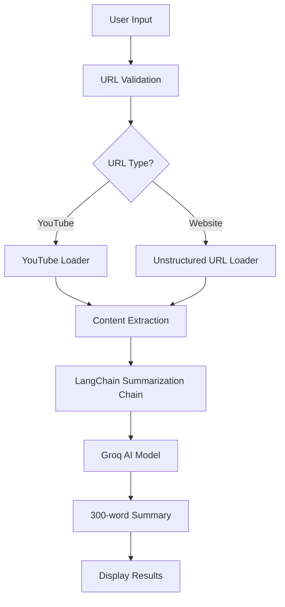

# 🦜 YouTube & Website Summarizer

<div align="center">


[](https://youtube-summarizer.streamlit.app)
[](https://github.com/yourusername/youtube-summarizer)
[](https://github.com/yourusername/youtube-summarizer)

</div>

---

## 📋 Table of Contents

- [✨ Features](#-features)
- [🚀 Quick Start](#-quick-start)
- [📦 Installation](#-installation)
- [🔧 Usage](#-usage)
- [🏗️ Architecture](#️-architecture)
- [📊 Tech Stack](#-tech-stack)
- [🤝 Contributing](#-contributing)


---

## ✨ Features

<div align="center">

| Feature | Description | Status |
|---------|-------------|--------|
| 🎥 **YouTube Summarization** | Extract and summarize YouTube video content | ✅ Active |
| 🌐 **Website Summarization** | Summarize any website content | ✅ Active |
| 🤖 **AI-Powered** | Powered by Groq's Gemma2-9b-it model | ✅ Active |
| 🎨 **Modern UI** | Beautiful Streamlit interface | ✅ Active |
| ⚡ **Fast Processing** | Quick content extraction and summarization | ✅ Active |
| 🔒 **Secure** | API key protection and input validation | ✅ Active |

</div>

---

## 🚀 Quick Start

### Prerequisites

- Python 3.10 or higher
- Groq API key ([Get one here](https://console.groq.com/))

### One-Command Setup

```bash
# Clone the repository
git clone https://github.com/yourusername/youtube-summarizer.git
cd youtube-summarizer

# Install dependencies
pip install -r requirements.txt

# Run the application
streamlit run app.py
```

---

## 📦 Installation

### Step 1: Clone the Repository

```bash
git clone https://github.com/yourusername/youtube-summarizer.git
cd youtube-summarizer
```

### Step 2: Create Virtual Environment

```bash
# Create virtual environment
python -m venv venv

# Activate virtual environment
# On Windows:
venv\Scripts\activate
# On macOS/Linux:
source venv/bin/activate
```

### Step 3: Install Dependencies

```bash
pip install -r requirements.txt
```

### Step 4: Run the Application

```bash
streamlit run app.py
```

---

## 🔧 Usage

### 1. **Get Your Groq API Key**
   - Visit [Groq Console](https://console.groq.com/)
   - Sign up/Login and generate your API key

### 2. **Launch the Application**
   - Run `streamlit run app.py`
   - Open your browser to `http://localhost:8501`

### 3. **Summarize Content**
   - Enter your Groq API key in the sidebar
   - Paste a YouTube URL or website URL
   - Click "Summarize the Content from YT or Website"
   - Get your 300-word summary!

### Supported URLs
- ✅ YouTube videos (`youtube.com/watch?v=...`)
- ✅ Any website URL (`https://example.com`)

---

## 🏗️ Architecture



---

## 📊 Tech Stack

<div align="center">

### Core Technologies

| Technology | Purpose | Version |
|------------|---------|---------|
| **Python** | Backend Language | 3.10+ |
| **Streamlit** | Web Interface | Latest |
| **LangChain** | AI Framework | Latest |
| **Groq** | AI Model Provider | Latest |

### Key Dependencies

| Package | Purpose |
|---------|---------|
| `langchain-groq` | Groq AI integration |
| `youtube_transcript_api` | YouTube content extraction |
| `unstructured` | Website content parsing |
| `validators` | URL validation |
| `streamlit` | Web application framework |

</div>

---

## 🎯 Project Structure

```
youtube-summarizer/
├── 📁 venv/                 # Virtual environment
├── 📄 app.py               # Main Streamlit application
├── 📄 requirements.txt     # Python dependencies
├── 📄 README.md           # Project documentation
└── 📁 __pycache__/        # Python cache files
```

---

## 🔧 Configuration

### Environment Variables

Create a `.env` file in the project root:

```env
GROQ_API_KEY=your_groq_api_key_here
```

### Customization Options

- **Summary Length**: Modify the prompt template in `app.py` (line 23-27)
- **AI Model**: Change the model in `app.py` (line 41)
- **UI Theme**: Customize Streamlit theme in `app.py`

---

## 🤝 Contributing

We welcome contributions! Here's how you can help:

### 🐛 Bug Reports
- Use GitHub Issues to report bugs
- Include steps to reproduce the issue
- Provide error messages and system information

### 💡 Feature Requests
- Suggest new features via GitHub Issues
- Describe the use case and expected behavior
- Consider contributing the implementation

### 🔧 Development Setup

1. Fork the repository
2. Create a feature branch: `git checkout -b feature/amazing-feature`
3. Make your changes
4. Commit your changes: `git commit -m 'Add amazing feature'`
5. Push to the branch: `git push origin feature/amazing-feature`
6. Open a Pull Request

---

### Community

[](https://discord.gg/your-discord)
[](https://twitter.com/yourusername)

</div>

---

## 📈 Project Stats

<div align="center">


</div>

---

<div align="center">

**Made with ❤️ using Streamlit, LangChain, and Groq AI**

[⬆ Back to Top](#-youtube--website-summarizer)

</div>
